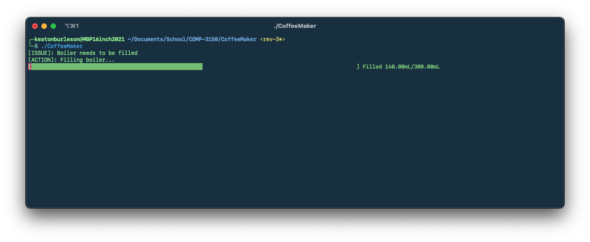

# COMP-3150 - Coffee Maker
## A virtual 'coffee maker' written in C++20



## Compiling
### CMake (recommended)

Inside the source repository, run the CMake configuration task:
```shell
$ cmake --configure .
```

Next, build with CMake:
```shell
$ cmake --build .
```

The executable should be available as `CoffeeMaker`

### Makefile
Inside the source repository, you should be able to run `make` like shown:
```shell
$ make
```

Which should result in the following output:
```text
rm -f CoffeeMaker
g++ -std=c++20  -pthread sleep.cpp main.cpp CoffeeMaker.cpp -o CoffeeMaker
```

The executable should be available as `CoffeeMaker`

### g++

Inside the source repository, you should be able to run `g++` like shown:
```shell
$ g++  -o ./CoffeeMaker -std=c++20  -pthread  main.cpp CoffeeMaker.cpp 
```

The executable should be available as `CoffeeMaker`

## Credits

[p-ranav/indicators](https://github.com/p-ranav/indicators) - Used for the progress bars
